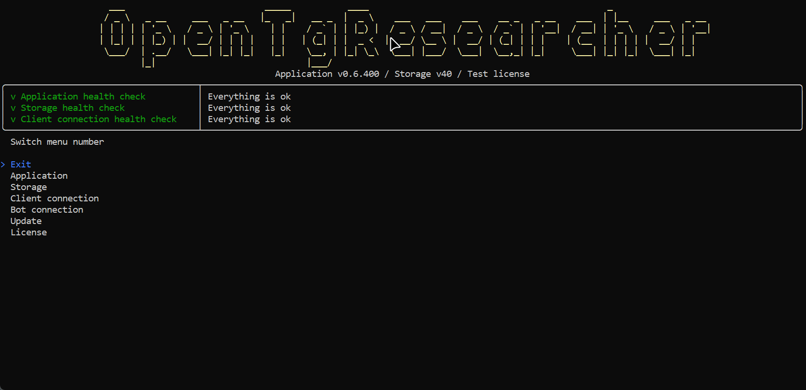
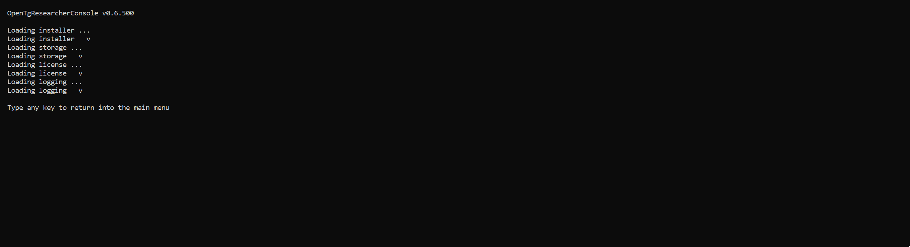

# OpenTgResearcher - Открытый исследователь Telegram

## Назначение продукта
Открытый исследователь и поисковик Телеграм. Скачивай чаты по каталогам. 

## Official site
### 
<b><a href="http://opentgresearcher.online">opentgresearcher.online</a></b>

### 
<b><a href="README.md">Readme</a> | <a href="Docs/CHANGELOG.md">Changelog</a> | <a href="Docs/RELEASES.md">Statistics</a></b>

### 
<b><a href="Docs/SCREENSHOTS.md">Screenshots</a> | <a href="Docs/GUIDES.md">Guides</a> | <a href="LICENSE.md">License</a></b>

## Официальный сайт
### 
<b><a href="http://opentgresearcher.ru">opentgresearcher.ru</a></b>

### 
<b><a href="README-RUS.md">Прочти меня</a> | <a href="Docs/CHANGELOG-RUS.md">История версий</a> | <a href="Docs/RELEASES-RUS.md">Статистика</a></b>

### 
<b><a href="Docs/SCREENSHOTS.md">Скриншоты</a> | <a href="Docs/GUIDES-RUS.md">Руководства</a> | <a href="LICENSE.md">Лицензия</a></b>

## Скачать
- [Релизы](https://github.com/DamianMorozov/OpenTgResearcher/releases)

## ГитХаб сообщество
- [ГитХаб репозиторий](https://github.com/DamianMorozov/OpenTgResearcher)
- [Сообщить об ошибке](https://github.com/DamianMorozov/OpenTgResearcher/issues)
- [Обсуждения](https://github.com/DamianMorozov/OpenTgResearcher/discussions)

## Поддержка пользователей
- [OpenTgResearcher группа](https://t.me/OpenTgResearcher)

## Docker
- [Докер образ](https://hub.docker.com/repository/docker/damianmorozov/opentgresearcher-console)

## Требования к установке
- [Зарегистрируйте Telegram приложение](https://my.telegram.org/apps)
- Сохраните значения полей секции `App configuration`: `App api_id` / `App api_hash`

## Заставка OpenTgResearcherDesktop

## Заставка OpenTgResearcherConsole

## OpenTgResearcherConsole - Мониторинг чатов

## OpenTgResearcherConsole - Поиск ключевых слов в чатах

