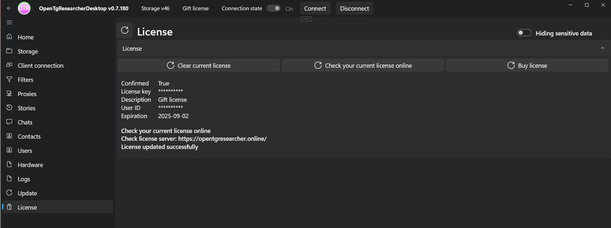
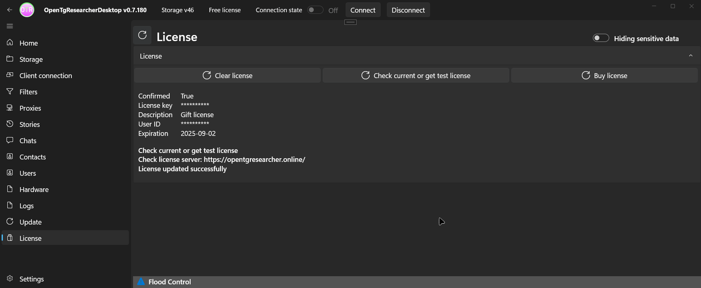
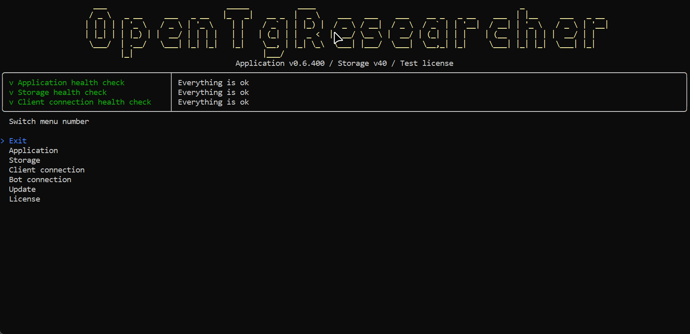
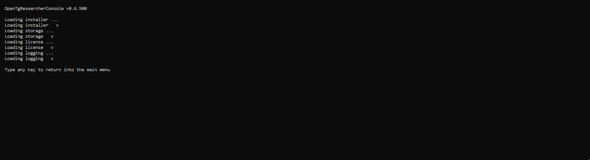

# OpenTgResearcher - инструмент анализа Telegram-чатов и скачивания их содержимого

## Назначение продукта
- Открытый исследователь и поисковик Телеграм
- Скачивай медиа файлы из чатов на свой диск
- Сохраняй сообщения чатов в локальное хранилище
- Просматривай расширенную информацию об участниках чатов
- Просматривай статистику чатов
- Используй как OSINT инструмент
- Используй как парсер инструмент

## Официальный сайт
### 
<b><a href="https://opentgresearcher.online">opentgresearcher.online</a></b>

## Русская документация
### 
<b><a href="README.md">Прочти меня</a> | <a href="Docs/CHANGELOG-RUS.md">История версий</a> | <a href="Docs/RELEASES.md">Статистика</a></b>

### 
<b><a href="Docs/SCREENSHOTS.md">Скриншоты</a> | <a href="Docs/GUIDES-RUS.md">Руководства</a> | <a href="LICENSE.md">Лицензия</a></b>

## Скачать
- [Релизы](https://github.com/DamianMorozov/OpenTgResearcher/releases)

## ГитХаб сообщество
- [ГитХаб репозиторий](https://github.com/DamianMorozov/OpenTgResearcher)
- [Сообщить о баге](https://github.com/DamianMorozov/OpenTgResearcher/issues)
- [Обсуждения](https://github.com/DamianMorozov/OpenTgResearcher/discussions)

## Поддержка пользователей
- [OpenTgResearcher группа в ТГ](https://t.me/OpenTgResearcher)

## Докер
- [Докер образ](https://hub.docker.com/repository/docker/damianmorozov/opentgresearcher-console)

## Требования к установке
- [Зарегистрируйте Telegram приложение](https://my.telegram.org/apps)
- Сохраните значения полей секции `App configuration`: `App api_id` / `App api_hash`

## Программа поощрения за обнаружение ошибок
- [Программа поощрения за обнаружение ошибок](https://opentgresearcher.online/bug-bounty)

## Проверка текущей лицензии в OpenTgResearcherDesktop
1. Очистить текущую лицензию
2. Подключиться к TG
3. Проверить свою текущую лицензию онлайн

## Ключевые слова
ОпенТгРесечер, ОпенТгРесёчер, Опен-Тг-Ресечер, Опен-Тг-Ресёчер, Телеграм, скачать, тгскачать, тг-скачать, ресёчер, ресечер, тгресечер, тг-ресечер, тгресёчер, тг-ресёчер

---

# OpenTgResearcher - tool for analyzing Telegram chats and downloading their content

## Product assignment
- Open Telegram explorer and search engine
- Download media files from chats to your disk
- Save chat messages to local storage
- View extended information about chat participants
- View chat statistics
- Use as an OSINT tool
- Use as a parser tool

## Official site
### 
<b><a href="https://opentgresearcher.online">opentgresearcher.online</a></b>

## Global documentation
### 
<b><a href="README.md">Readme</a> | <a href="Docs/CHANGELOG.md">Changelog</a> | <a href="Docs/RELEASES.md">Statistics</a></b>

### 
<b><a href="Docs/SCREENSHOTS.md">Screenshots</a> | <a href="Docs/GUIDES.md">Guides</a> | <a href="LICENSE.md">License</a></b>

## Download
- [Releases](https://github.com/DamianMorozov/OpenTgResearcher/releases)

## GitHub community
- [GitHub repository](https://github.com/DamianMorozov/OpenTgResearcher)
- [Report a bug](https://github.com/DamianMorozov/OpenTgResearcher/issues)
- [Discussions](https://github.com/DamianMorozov/OpenTgResearcher/discussions)

## User support
- [OpenTgResearcher group in TG](https://t.me/OpenTgResearcher)

## Docker
- [Docker image](https://hub.docker.com/repository/docker/damianmorozov/opentgresearcher-console)

## Install Requirements
- [Register Telegram app](https://my.telegram.org/apps)
- Save the values of the fields by `App configuration` section: `App api_id` / `App api_hash`

## Bug Bounty Program
- [Bug Bounty Program](https://opentgresearcher.online/bug-bounty)

## Checking your current license in OpenTgResearcherDesktop
1. Clear your current license
2. Connect to TG
3. Check your current license online

## Keywords
OpenTgResearcher, Open-Tg-Researcher, Telegram, downloader, tgdownloader, tg-downloader, researcher, tgresearcher, tg-researcher

---

# OpenTgResearcher: herramienta para analizar chats de Telegram y descargar su contenido

## Finalidad del producto
- Investigador abierto y buscador de Telegram
- Descarga archivos multimedia de los chats a tu disco
- Guarda los mensajes de los chats en el almacenamiento local
- Consulta información detallada sobre los participantes en los chats
- Consulte las estadísticas de los chats
- Utilícelo como herramienta OSINT
- Utilícelo como herramienta de análisis sintáctico

## Sitio web oficial
### 
<b><a href="https://opentgresearcher.online">opentgresearcher.online</a></b>

## Documentación en ruso
### 
<b><a href="README.md">Léeme</a> | <a href="Docs/CHANGELOG-RUS.md">Historial de versiones</a> | <a href="Docs/RELEASES.md">Estadísticas</a></b>

### 
<b><a href="Docs/SCREENSHOTS.md">Capturas de pantalla</a> | <a href="Docs/GUIDES-RUS.md">Guías</a> | <a href="LICENSE.md">Licencia</a></b>

## Descargar
- [Versiones](https://github.com/DamianMorozov/OpenTgResearcher/releases)

## Comunidad GitHub
- [Repositorio GitHub](https://github.com/DamianMorozov/OpenTgResearcher)
- [Informar de un error](https://github.com/DamianMorozov/OpenTgResearcher/issues)
- [Debates](https://github.com/DamianMorozov/OpenTgResearcher/discussions)

## Soporte al usuario
- [Grupo OpenTgResearcher en Telegram](https://t.me/OpenTgResearcher)

## Docker
- [Imagen Docker](https://hub.docker.com/repository/docker/damianmorozov/opentgresearcher-console)

## Requisitos de instalación
- [Regístrese en la aplicación Telegram](https://my.telegram.org/apps)
- Guarde los valores de los campos de la sección «Configuración de la aplicación»: «App api_id» / «App api_hash»

## Programa de recompensa por detectar errores
- [Programa de recompensa por detectar errores](https://opentgresearcher.online/bug-bounty)

## Comprobación de la licencia actual en OpenTgResearcherDesktop
1. Borrar la licencia actual
2. Conectarse a TG
3. Compruebe su licencia actual en línea

## Palabras clave
OpenTGResearcher, OpenTGResearcher, Open-TG-Researcher, Open-TG-Researcher, Telegram, descargar, tgdescargar, tg-descargar, researcher, researcher, tgresearcher, tg-researcher, tgresearcher, tg-researcher

---

# OpenTgResearcher - 用于分析Telegram聊天并下载其内容的工具

## 产品用途
- 开放式Telegram研究工具与搜索引擎
- 将聊天中的媒体文件下载至本地硬盘
- 将聊天记录保存至本地存储空间
- 查看聊天参与者的详细信息
- 查看聊天统计数据
- 作为OSINT工具使用
- 作为解析工具使用

## 官方网站
### 
<b><a href="https://opentgresearcher.online">opentgresearcher.online</a></b>

## 俄语文档
### 
<b><a href="README.md">阅读说明</a> | <a href="Docs/CHANGELOG-RUS.md">版本历史</a> | <a href="Docs/RELEASES.md">统计数据</a></b>

### 
<b><a href="Docs/SCREENSHOTS.md">截图</a> | <a href="Docs/GUIDES-RUS.md">指南</a> | <a href="LICENSE.md">许可协议</a></b>

## 下载
- [版本](https://github.com/DamianMorozov/OpenTgResearcher/releases)

## GitHub 社区
- [GitHub 仓库](https://github.com/DamianMorozov/OpenTgResearcher)
- [提交错误报告](https://github.com/DamianMorozov/OpenTgResearcher/issues)
- [讨论区](https://github.com/DamianMorozov/OpenTgResearcher/discussions)

## 用户支持
- [OpenTgResearcher Telegram群组](https://t.me/OpenTgResearcher)

## Docker
- [Docker镜像](https://hub.docker.com/repository/docker/damianmorozov/opentgresearcher-console)

## 安装要求
- [注册Telegram应用](https://my.telegram.org/apps)
- 保存`应用配置`部分字段值：`应用api_id` / `应用api_hash`

## 漏洞悬赏计划
- [漏洞悬赏计划](https://opentgresearcher.online/bug-bounty)

## 在 OpenTgResearcherDesktop 中检查当前许可证
1. 清除当前许可证
2. 连接 Telegram
3. 在线检查当前许可证

## 关键词
OpenTgResearcher, Open-Tg-Researcher, Telegram, 下载器, tgdownloader, tg-downloader, 研究员, tgresearcher, tg-researcher

---

## Анимации и скриншоты / Animations and screenshots / Animaciones y capturas de pantalla / 动画与截图

### Заставка OpenTgResearcherDesktop / OpenTgResearcherDesktop Splash screen / Pantalla de inicio de OpenTgResearcherDesktop / OpenTgResearcherDesktop 启动画面

### Заставка OpenTgResearcherConsole / OpenTgResearcherConsole Splash screen / Pantalla de inicio de OpenTgResearcherConsole / OpenTgResearcherConsole 启动画面

### OpenTgResearcherConsole - Мониторинг чатов / OpenTgResearcherConsole - Monitoring chats / OpenTgResearcherConsole - Supervisión de chats / OpenTgResearcherConsole - 聊天监控

### OpenTgResearcherConsole - Поиск ключевых слов в чатах / OpenTgResearcherConsole - Search for keywords in chats / OpenTgResearcherConsole - Búsqueda de palabras clave en chats / OpenTgResearcherConsole - 聊天中的关键词搜索

