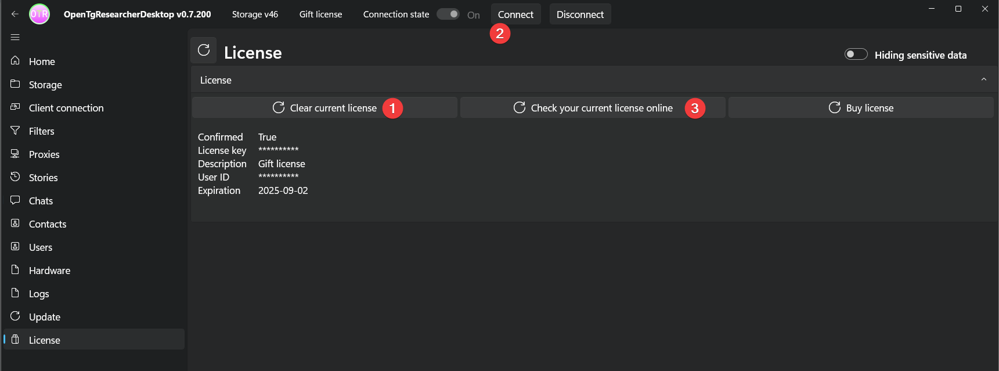

# OpenTgResearcher - инструмент для анализа Telegram-чатов и скачивания их содержимого

## Назначение продукта
Открытый исследователь и поисковик Телеграм:
- Скачивай медиа файлы чатов на свой диск
- Скачивай сообщения чатов в локальное хранилище
- Просматривай расширенную информацию об участниках чатов
- Просматривай статистику чатов
- OSINT инструмент
- Парсер инструмент

## Официальный сайт
### 
<b><a href="https://opentgresearcher.online">opentgresearcher.online</a></b>

## Русская документация
### 
<b><a href="README.md">Прочти меня</a> | <a href="Docs/CHANGELOG-RUS.md">История версий</a> | <a href="Docs/RELEASES.md">Статистика</a></b>

### 
<b><a href="Docs/SCREENSHOTS.md">Скриншоты</a> | <a href="Docs/GUIDES-RUS.md">Руководства</a> | <a href="LICENSE.md">Лицензия</a></b>

## Скачать
- [Релизы](https://github.com/DamianMorozov/OpenTgResearcher/releases)

## ГитХаб сообщество
- [ГитХаб репозиторий](https://github.com/DamianMorozov/OpenTgResearcher)
- [Сообщить о баге](https://github.com/DamianMorozov/OpenTgResearcher/issues)
- [Обсуждения](https://github.com/DamianMorozov/OpenTgResearcher/discussions)

## Поддержка пользователей
- [OpenTgResearcher группа в ТГ](https://t.me/OpenTgResearcher)

## Докер
- [Докер образ](https://hub.docker.com/repository/docker/damianmorozov/opentgresearcher-console)

## Требования к установке
- [Зарегистрируйте Telegram приложение](https://my.telegram.org/apps)
- Сохраните значения полей секции `App configuration`: `App api_id` / `App api_hash`

## Программа поощрения за обнаружение ошибок
- [Программа поощрения за обнаружение ошибок](https://opentgresearcher.online/bug-bounty)

## Заставка OpenTgResearcherDesktop

## Заставка OpenTgResearcherConsole

## OpenTgResearcherConsole - Мониторинг чатов

## OpenTgResearcherConsole - Поиск ключевых слов в чатах

## Проверка текущей лицензии в OpenTgResearcherDesktop
1. Очистить текущую лицензию
2. Подключиться к TG
3. Проверить свою текущую лицензию онлайн

## Ключевые слова
ОпенТгРесечер, ОпенТгРесёчер, Опен-Тг-Ресечер, Опен-Тг-Ресёчер, Телеграм, скачать, тгскачать, тг-скачать, ресёчер, ресечер, тгресечер, тг-ресечер, тгресёчер, тг-ресёчер

---

# OpenTgResearcher - tool for analyzing Telegram chats and downloading their content

## Product assignment
Telegram's open researcher and search engine:
- Download the chat media files to your disk
- Download chat messages to local storage
- View expanded information about chat participants
- View chat statistics
- OSINT tool
- Parser tool

## Official site
### 
<b><a href="https://opentgresearcher.online">opentgresearcher.online</a></b>

## Global documentation
### 
<b><a href="README.md">Readme</a> | <a href="Docs/CHANGELOG.md">Changelog</a> | <a href="Docs/RELEASES.md">Statistics</a></b>

### 
<b><a href="Docs/SCREENSHOTS.md">Screenshots</a> | <a href="Docs/GUIDES.md">Guides</a> | <a href="LICENSE.md">License</a></b>

## Download
- [Releases](https://github.com/DamianMorozov/OpenTgResearcher/releases)

## GitHub community
- [GitHub repository](https://github.com/DamianMorozov/OpenTgResearcher)
- [Report a bug](https://github.com/DamianMorozov/OpenTgResearcher/issues)
- [Discussions](https://github.com/DamianMorozov/OpenTgResearcher/discussions)

## User support
- [OpenTgResearcher group in TG](https://t.me/OpenTgResearcher)

## Docker
- [Docker image](https://hub.docker.com/repository/docker/damianmorozov/opentgresearcher-console)

## Install Requirements
- [Register Telegram app](https://my.telegram.org/apps)
- Save the values of the fields by `App configuration` section: `App api_id` / `App api_hash`

## Bug Bounty Program
- [Bug Bounty Program](https://opentgresearcher.online/bug-bounty)

## OpenTgResearcherDesktop Splash screen

## OpenTgResearcherConsole Splash screen

## OpenTgResearcherConsole - Monitoring chats

## OpenTgResearcherConsole - Search for keywords in chats

## Checking your current license in OpenTgResearcherDesktop
1. Clear your current license
2. Connect to TG
3. Check your current license online

## Keywords
ОпенТгРесечер, ОпенТгРесёчер, Опен-Тг-Ресечер, Опен-Тг-Ресёчер, Телеграм, скачать, тгскачать, тг-скачать, ресёчер, ресечер, тгресечер, тг-ресечер, тгресёчер, тг-ресёчер
